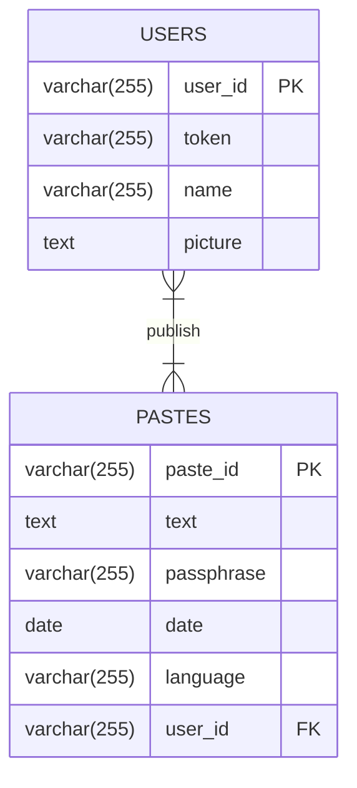

# TextDrop
TextDrop é un progetto che prevede la possibilitá di condividere testi, link ma soprattutto codice sorgente attraverso un link. Ispirato al noto sito "[pastebin](www.pastebim.com)". 

## Registrazione e Login
Per registare e loggarsi al sito é stato utilizzato [Google OAuth2](https://yobaji.github.io/vue3-google-login/#installation), implementato con un pacchetto apposito per VueJS.</br>
Il funzionamento consiste nel validare a lato back-end un token ottenuto dal client, ottenendo cosí un altro token univoco per ogni utente.</br>
ecco un esempio di come viene implementato:
```js
async function verifyToken(token) {
  client.setCredentials({ access_token: token })
  const userinfo = await client.request({
    url: "https://www.googleapis.com/oauth2/v3/userinfo",
  });
  return userinfo.data
}
```

## Hashing Passphrase
Seppur la registrazione avvenga unicamente tramite Google OAuth2, il sito prevede anche la possibilitá di proteggere i propri post tramite una passphrase, per motivi di sicurezza ho deciso di salvarle nel db dopo un hashing mediante [bcrypt](https://www.npmjs.com/package/bcrypt). 

## Database
Rappresentazione ER del database:

